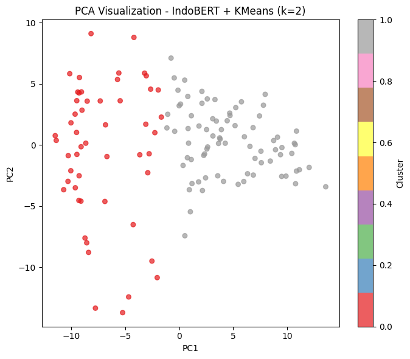

# Public-Opinion-Analysis-Impact-Of-AI-On-Indonesian-Education

## Summary
This project applies Unsupervised Learning to analyze public sentiment and opinion in Indonesia regarding the impact of Artificial Intelligence (AI) in education. The analysis extracts insights from YouTube comments by comparing a persona-based Clustering technique with Topic Extraction.

## Problem
1. **Large-Scale Opinion Mapping:** Needed to automatically extract and analyze data from YouTube video comments to understand public sentiment regarding AI's impact on the Indonesian education system.
2. **Identifying NLP Limitations:** Aimed to identify and demonstrate the fundamental differences between persona-based Clustering models versus Topic Extraction in interpreting global comment themes.

## Methodology
1. **Data Collection:** Scraped user comments from various YouTube videos discussing the impact of artificial intelligence in educational settings.
2. **Pre-processing & Text Representation:** Processed raw text through fundamental NLP pre-processing pipelines and applied at least 2 different text representation approaches.
3. **Clustering (K-Means):** Implemented clustering methods and compared Silhouette Scores to justify the optimal number of clusters (k).
4. **Persona Analysis:** Conducted a deep dive into the results of each cluster to extract unique characteristics, formulating accurate "persona names" for different groups of user opinions.
5. **Topic Extraction & Comparison:** Extracted the main themes emerging across all comments, then compared the insights generated from this Topic Extraction method with the persona groupings derived from Clustering.

## Skills
1. **Python:** Data Manipulation
2. **Data Collection:** Web Scraping
3. **Unsupervised Learning (NLP):** Clustering (K-value selection), Persona Analysis, Silhouette Score, Topic Extraction, Text Representation

## Results
1. NLP Approach Mapping: Discovered that Topic Extraction is ideal for capturing global themes comprehensively, while Clustering excels at grouping comments by similarity to form distinct commentator "personas."
2. **Public Opinion Personas Discovered:** The models successfully highlighted contrasting sentiments from the raw data. Discovered distinct personas ranging from highly optimistic tech-advocates to pessimistic groups fearful of AI replacing human jobs.
3. **Methodological Synergy:** Relying strictly on a single approach (e.g., semantic clustering with a limited number of clusters) obscured many valuable opinions. Combining multiple approaches, utilizing the strengths and weaknesses of each, provided much richer and broader insights for the project.

## Next Steps
1. **Sentiment Visualization:** Convert the extracted opinion data (Optimistic vs. Pessimistic/Fearful) into interactive visualization dashboards for easy navigation by non-technical teams.
2. **Supervised Modeling:** Use the formulated persona cluster names as pseudo-labels to train a predictive supervised classification model in the future.
